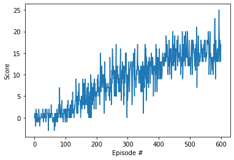

Author: [Fares El Kahla](https://github.com/faresbkh) 

The goal of this project is to explore the application of Deep Q-Network (DQN) in the context of Reinforcement Learning (RL). In particular, the focus is on using DQN to learn an optimal policy for playing the Banana Unity game. This game involves a continuous state space with 37 dimensions and requires the agent to navigate and collect yellow bananas while avoiding blue bananas. The agent has four actions at its disposal: move left, right, forward, and backward.

DQN is a type of value-based method in RL that has been successfully used in many challenging control problems. By using a neural network to approximate the Q-function, DQN is able to learn the optimal policy from raw sensory inputs. In this project, we aim to demonstrate the ability of DQN to learn a suitable policy in the Banana Unity game.

This report provides an overview of the implementation of DQN on the Banana Unity game, including details on the design and architecture of the Double DQN algorithm, as well as a discussion of the results obtained. The report concludes with some reflections on the strengths and limitations of the method, as well as suggestions for future work.

The following report is written in four parts:

- **Implementation**
- **Results**
- **HyperParameters**
- **Ideas for improvement** 

## Implementation

The project started with the implementation of Deep Q-Network (DQN), a value-based method in Reinforcement Learning (RL). In DQN, a neural network is used to approximate the Q-function, which maps states and actions to a scalar reward. The network is trained to minimize the difference between its predicted Q-values and the target Q-values, which are obtained from the environment.

However, the results obtained from DQN were not satisfactory, leading to the implementation of Double Deep Q-Network (Double DQN). Double DQN is a variant of DQN that addresses the over-estimation bias in the Q-value estimates. In Double DQN, two separate networks are used, one for selecting the best action and another for evaluating the action. By decoupling the selection and evaluation of actions, Double DQN is able to reduce the over-estimation bias and produce more accurate Q-value estimates.

The reason why Double DQN is better than DQN is that it overcomes the over-estimation bias in Q-value estimates, which can result in suboptimal policies. By using two separate networks for selection and evaluation, Double DQN ensures that the Q-value estimates are more accurate and closer to the true Q-values. This leads to improved performance in the RL task and more effective learning of the optimal policy.

Beside the tuning of DQN, a tuning was performed on the Qnetwork, by increasing the number of neurons in each hidden layer and adding dropout layers, an extra layer of overfitting prevention was added.

  ### Hyperparameters

  There were many hyperparameters involved in the experiment. The value of each of them is given below:

  | Hyperparameter                      | Value |
  | ----------------------------------- | ----- |
  | Replay buffer size                  | 1e5   |
  | Batch size                          | 64    |
  | $\gamma$ (discount factor)          | 0.99  |
  | $\tau$                              | 1e-3  |
  | Learning rate                       | 5e-4  |
  | update interval                     | 4     |
  | Number of episodes                  | 500   |
  | Max number of timesteps per episode | 2000  |
  | Epsilon start                       | 1.0   |
  | Epsilon minimum                     | 0.01  |
  | Epsilon decay                       | 0.995 |
  | Hidden layers                       |   2   |
  | Hidden layers units                 |  128  |
  | Dropout                             |  20%  |

 ### Results
The Double DQN achieved +15 score in  less than 600 episodes

| Double DQN  |
| --------------------------------------------------- |
|  

### Ideas for improvement

####  There are several potential improvements that can be made to the implementation of Deep Q-Network (DQN) and its variants, such as Double DQN. Some of these improvements include:

* Prioritized Experience Replay: In the standard experience replay method used in DQN, the transitions are stored in a replay buffer and randomly sampled for learning. However, this method does not prioritize transitions that are more important for learning. Prioritized experience replay addresses this issue by prioritizing transitions based on their TD error, allowing the network to learn from the most important experiences first. You can read more about prioritized experience replay in the paper "Prioritized Experience Replay" by Tom Schaul, John Quan, Ioannis Antonoglou, and David Silver.

* Dueling DQN: Dueling DQN is a variant of DQN that separates the network into two streams, one for estimating the state value function and another for estimating the advantage function. By decoupling these two functions, Dueling DQN is able to more effectively learn the optimal policy. You can read more about Dueling DQN in the paper "Dueling Network Architectures for Deep Reinforcement Learning" by Ziyu Wang, Tom Schaul, Matteo Hessel, Hado van Hasselt, Marc Lanctot, and Nando de Freitas.

* Rainbow: Rainbow is a combination of several improvements to DQN, including multi-step learning, prioritized experience replay, dueling network architecture, and distributional reinforcement learning. By combining these techniques, Rainbow is able to achieve state-of-the-art performance in many RL tasks. You can read more about Rainbow in the paper "Rainbow: Combining Improvements in Deep Reinforcement Learning" by Matteo Hessel, Joseph Modayil, Hado van Hasselt, Tom Schaul, Georg Ostrovski, Will Dabney, Dan Horgan, Bilal Piot, Mohammad Azar, and David Silver.